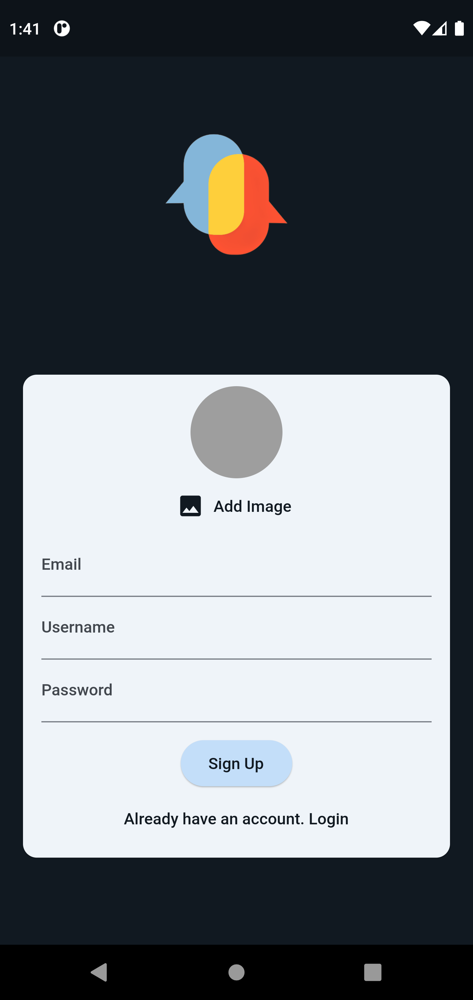
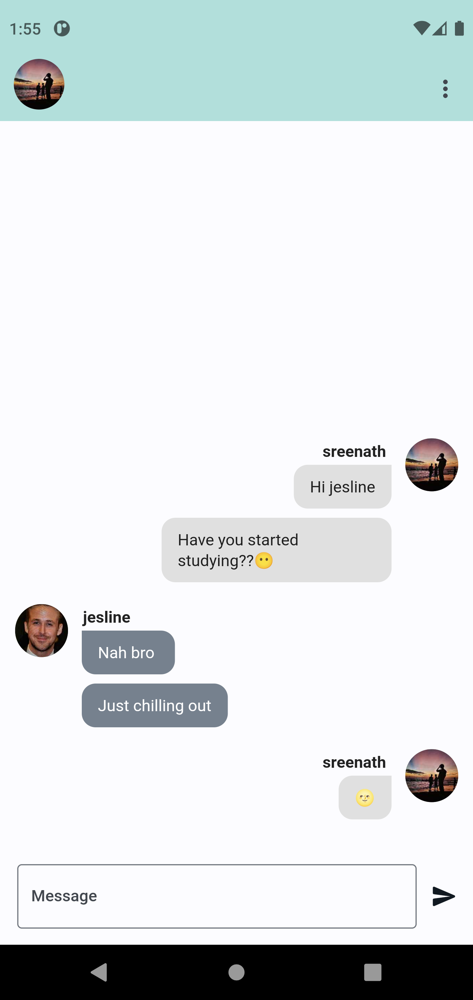
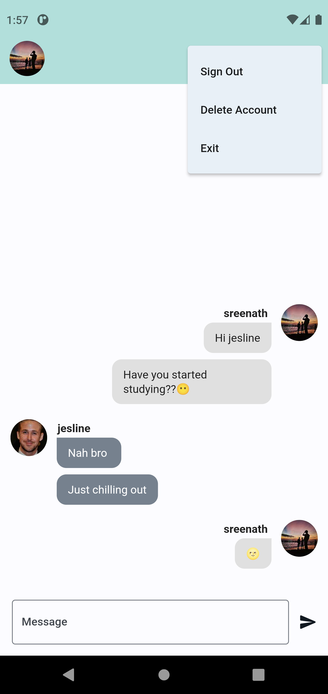

  
  <h1>Chatter</h1>

Chatter is a simple yet powerful chat app built using Flutter and Firebase. It connects people with real-time messaging.

## Features

- **Real-time Messaging**

- **User Authentication**

- **User profile creation**

- **Delete chat history and Acccount**

## Screenshots

<table>
  <tr>
    <td>Signup</td>
    <td>Home</td>
    <td>Options</td>
  </tr>
  <tr>
    <td></td>
    <td></td>
    <td></td>
  </tr>
 </table>

